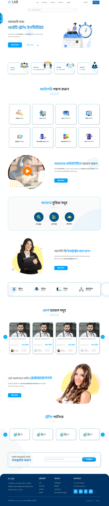
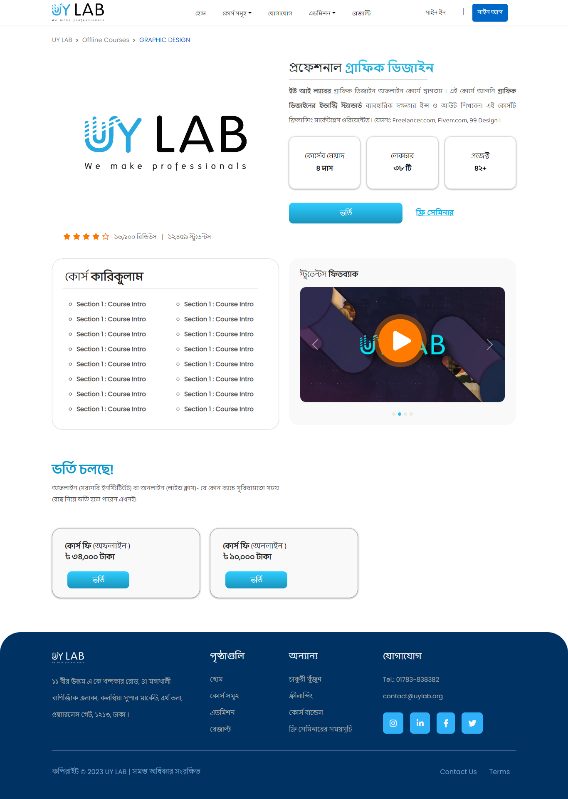
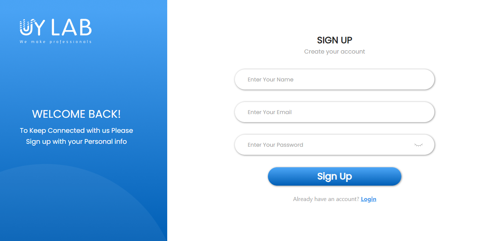
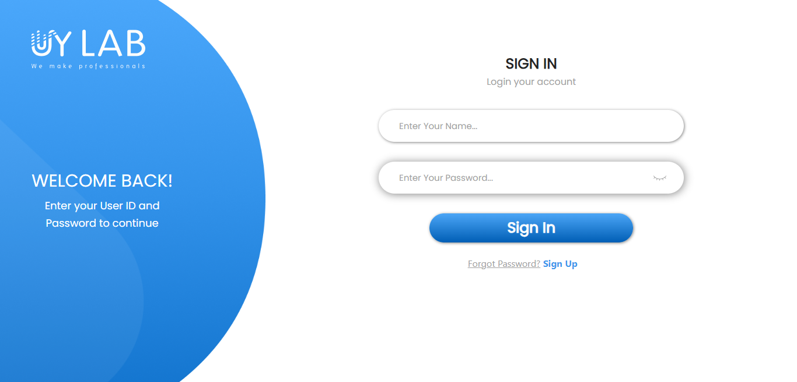

# Figma to Html (Website Template) !

It's a simple **Figma to Html** responsive multiple pages Learning Management System (LMS) website template. Worked on **4 Pages** including...
 - Index ( Main )
 - Sign In 
 - Sign Up
 - Course Category ( Graphics Design )

## Author

[Fatema Akther Prianka 🤗](https://github.com/Prianka-Mimi)

## Features

- Hero Section

- Sticky Contact

- Course Category

- Join Community

- Services

- Opportunities

- Bundle Offers

- Up to Date Email Subscribe Section

- Contact

## Has Been Used

 - Html
 - Css
	 - animate css
 - Java Script
	-  Eye Toggle ( Password Show | Hide ) 
	- JQuery 
	- Wow js
	- Numscroll
	- Slick slider
	- Venobox

	
## View In Short

**Main Website**

**Course Category**

> Enter from Navigation Bar Course Somuho - Graphics Design

> Enter from Category - Graphics Design

**Sign Up**

**Sign In**

  
## Contact

[🌐 Fatema Akther Prianka](https://webdeveloperprianka.netlify.app/)

[Linkedin](https://www.linkedin.com/in/fatema-akther-prianka/)

[FaceBook](https://www.facebook.com/fatemaaktherprianka.webdeveloper)

[Stack Overflow](https://stackoverflow.com/users/23182049/prianka-mimi)